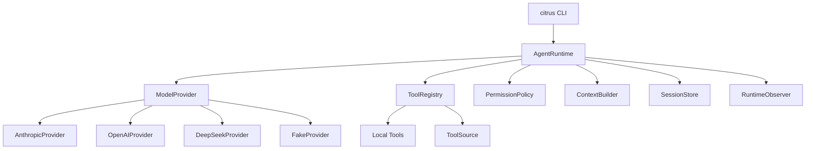

# CitrusButter

CitrusButter is a Python SDK + CLI coding agent harness. It is designed as a
small runtime kernel with clear extension points for model providers, tools,
permissions, context, memory, sessions, and future MCP support.

The first version focuses on a lightweight but real foundation:

- `citrus` CLI entry point
- Python SDK package under `citrus`
- Runtime-kernel architecture
- Anthropic, OpenAI, DeepSeek, and Fake provider adapters
- Local coding tools for file reads, file writes, search, and shell commands
- Permission checks before risky tool execution
- JSONL and in-memory session stores
- Memory and ToolSource extension boundaries
- Test-first implementation workflow with `pytest`, `ruff`, and `mypy`

See [docs/V1_ARCHITECTURE.md](docs/V1_ARCHITECTURE.md) for the current V1
architecture plan.

## Quickstart

```bash
uv sync --extra dev
uv run citrus --help
uv run citrus run "say hello" --provider fake --fake-response "hello"
```

For real providers, set the relevant API key and choose a provider:

```bash
export ANTHROPIC_API_KEY="..."
uv run citrus run "inspect this project" --provider anthropic --model claude-sonnet-4-5
```

```bash
export OPENAI_API_KEY="..."
uv run citrus run "inspect this project" --provider openai --model gpt-4.1
```

```bash
export DEEPSEEK_API_KEY="..."
uv run citrus run "inspect this project" --provider deepseek --model deepseek-chat
```

You can also use a TOML config file. By default CitrusButter reads:

```text
~/.config/citrus/config.toml
```

Set `CITRUS_CONFIG` to use a different file:

```bash
export CITRUS_CONFIG="/path/to/config.toml"
```

Example config:

```toml
provider = "anthropic"
model = "claude-sonnet-4-5"

[providers.anthropic]
api_key = "sk-ant-..."
model = "claude-sonnet-4-5"

[providers.openai]
api_key = "sk-..."
model = "gpt-4.1"

[providers.deepseek]
api_key = "sk-..."
model = "deepseek-chat"
base_url = "https://api.deepseek.com"
```

Precedence is:

```text
CLI flags > environment variables > provider-specific config > global config > defaults
```

Environment variables such as `ANTHROPIC_API_KEY`, `OPENAI_API_KEY`,
`DEEPSEEK_API_KEY`, `CITRUS_PROVIDER`, and `CITRUS_MODEL` still work and
override the config file.

## Architecture



The core design rule is simple: `AgentRuntime` owns the loop, while providers,
tools, permissions, context, sessions, memory, and observers remain replaceable
dependencies.

## SDK Example

```python
from pathlib import Path

from citrus.context.builder import ContextBuilder
from citrus.permissions.policy import GradedPermissionPolicy
from citrus.providers.base import ModelResponse
from citrus.providers.fake import FakeProvider
from citrus.runtime.agent import AgentRuntime, RunRequest
from citrus.runtime.messages import Message
from citrus.sessions.memory import InMemorySessionStore
from citrus.tools.registry import ToolRegistry

runtime = AgentRuntime(
    provider=FakeProvider([ModelResponse(messages=[Message.assistant_text("done")])]),
    tools=ToolRegistry.with_default_local_tools(),
    permissions=GradedPermissionPolicy(auto_approve=True),
    context=ContextBuilder(),
    session_store=InMemorySessionStore(),
)

result = runtime.run(RunRequest(task="inspect this project", workspace=Path.cwd()))
print(result.final_message)
```

## CLI

```bash
citrus run "add tests for the parser"
citrus providers
citrus config
```

`citrus run` uses the SDK runtime. The fake provider is deterministic and useful
for offline demos and tests. Real providers are selected with `--provider` and
API keys from environment variables.

## Development

```bash
uv sync --extra dev
uv run pytest
uv run ruff check .
uv run mypy src
```

## Project Docs

- [V1 Architecture](docs/V1_ARCHITECTURE.md)
- [Roadmap](docs/ROADMAP.md)
- [Runtime Kernel ADR](docs/ADR/0001-runtime-kernel.md)
- [Memory Boundary ADR](docs/ADR/0002-memory-boundary.md)
- [ToolSource For MCP ADR](docs/ADR/0003-toolsource-for-mcp.md)
