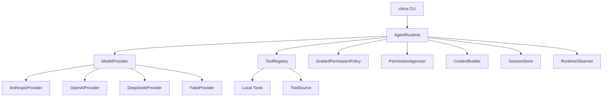

# CitrusButter

CitrusButter is a Python SDK + CLI coding agent harness. It is designed as a
small runtime kernel with clear extension points for model providers, tools,
permissions, context, memory, sessions, and future MCP support.

The first version focuses on a lightweight but real foundation:

- `citrus` CLI entry point with one-shot and interactive modes
- Python SDK package under `citrus`
- Runtime-kernel architecture
- Anthropic, OpenAI, DeepSeek, and Fake provider adapters
- Local coding tools for file reads, file writes, search, and shell commands
- Permission checks and CLI approval prompts before risky tool execution
- JSONL and in-memory session stores
- Memory and ToolSource extension boundaries
- Test-first implementation workflow with `pytest`, `ruff`, and `mypy`

See [docs/V1_ARCHITECTURE.md](docs/V1_ARCHITECTURE.md) for the current V1
architecture plan.

## Current Status

V1 is implemented and verified. The current CLI can:

- Read project-local configuration from `.citrus/config.toml`.
- Run deterministic fake-provider smoke tests.
- Start a process-local `citrus chat` session that keeps model context across
  turns until `exit`, `quit`, or `:q`.
- Instantiate Anthropic, OpenAI, and DeepSeek providers from config or
  environment variables.
- Execute the runtime loop with local tools, permission checks, interactive
  approval for `ask` decisions, and structured session events.

V2 context work is in progress on top of V1. The current development tree adds
`ContextBuilder` history assembly and a deterministic `ContextCompactor` that
runs before provider calls, preserving tool-call/tool-result pairs while keeping
active chat history bounded.

Latest verified checks:

```text
.venv/bin/pytest      63 passed
.venv/bin/ruff check  All checks passed
.venv/bin/mypy src    Success
```

Manual provider smoke:

```bash
.venv/bin/citrus run "Reply with exactly: citrus-ok" --provider deepseek
```

Expected output:

```text
citrus-ok
```

## Quickstart

```bash
uv sync --extra dev
uv run citrus --help
uv run citrus run "say hello" --provider fake --fake-response "hello"
uv run citrus chat --provider fake --fake-response "hello"
```

For real providers, set the relevant API key and choose a provider:

```bash
export ANTHROPIC_API_KEY="..."
uv run citrus run "inspect this project" --provider anthropic --model claude-sonnet-4-5
```

```bash
export OPENAI_API_KEY="..."
uv run citrus run "inspect this project" --provider openai --model gpt-4.1
```

```bash
export DEEPSEEK_API_KEY="..."
uv run citrus run "inspect this project" --provider deepseek --model deepseek-chat
```

You can also use a TOML config file. For project-local development, create:

```text
.citrus/config.toml
```

The `.citrus/` directory is ignored by git because it may contain API keys.
The repository includes a local `.citrus/config.toml` placeholder for your
machine, but it is intentionally not tracked by git.

If no project-local config exists, CitrusButter falls back to:

```text
~/.config/citrus/config.toml
```

Set `CITRUS_CONFIG` to use a different file:

```bash
export CITRUS_CONFIG="/path/to/config.toml"
```

Example config:

```toml
provider = "anthropic"
model = "claude-sonnet-4-5"

[providers.anthropic]
api_key = "sk-ant-..."
model = "claude-sonnet-4-5"

[providers.openai]
api_key = "sk-..."
model = "gpt-4.1"

[providers.deepseek]
api_key = "sk-..."
model = "deepseek-chat"
base_url = "https://api.deepseek.com"
```

Precedence is:

```text
CLI flags > environment variables > CITRUS_CONFIG > .citrus/config.toml > ~/.config/citrus/config.toml > defaults
```

Environment variables such as `ANTHROPIC_API_KEY`, `OPENAI_API_KEY`,
`DEEPSEEK_API_KEY`, `CITRUS_PROVIDER`, and `CITRUS_MODEL` still work and
override the config file.

## Architecture



The core design rule is simple: `AgentRuntime` owns the loop, while providers,
tools, permissions, context, sessions, memory, and observers remain replaceable
dependencies.

## SDK Example

```python
from pathlib import Path

from citrus.context.builder import ContextBuilder
from citrus.permissions.base import PermissionDecision, PermissionRequest
from citrus.permissions.policy import GradedPermissionPolicy
from citrus.providers.base import ModelResponse
from citrus.providers.fake import FakeProvider
from citrus.runtime.agent import AgentRuntime, RunRequest
from citrus.runtime.messages import Message
from citrus.sessions.memory import InMemorySessionStore
from citrus.tools.registry import ToolRegistry

def approve(request: PermissionRequest) -> PermissionDecision:
    return PermissionDecision(outcome="allow", reason=f"Approved {request.tool_name}")


runtime = AgentRuntime(
    provider=FakeProvider([ModelResponse(messages=[Message.assistant_text("done")])]),
    tools=ToolRegistry.with_default_local_tools(),
    permissions=GradedPermissionPolicy(auto_approve=False),
    context=ContextBuilder(),
    session_store=InMemorySessionStore(),
    permission_approver=approve,
)

result = runtime.run(RunRequest(task="inspect this project", workspace=Path.cwd()))
print(result.final_message)
```

## CLI

```bash
citrus run "add tests for the parser"
citrus chat
citrus providers
citrus config
```

`citrus run` uses the SDK runtime for a single task. `citrus chat` uses the
same runtime dependencies but keeps the successful model messages in memory
between prompts, so each new input can build on prior user, assistant, and tool
messages. Type `exit`, `quit`, or `:q` to leave the chat session.

The fake provider is deterministic and useful for offline demos and tests. Real
providers are selected with `--provider` and API keys from environment variables.
When the policy returns `ask`, the CLI prints the tool details and requires an
explicit approval; pressing Enter keeps the safe default and denies the tool.

## Sessions

The SDK includes two session stores:

- `InMemorySessionStore`: used by the current CLI. Events are available only
  while the process is running.
- `JsonlSessionStore`: implemented for persistent event logs, but not yet wired
  into the CLI by default.

The next practical step is to add a CLI option such as `--session-dir
.citrus/sessions` and persist each run as JSONL.

## Development

```bash
uv sync --extra dev
uv run pytest
uv run ruff check .
uv run mypy src
```

## Project Docs

- [V1 Architecture](docs/V1_ARCHITECTURE.md)
- [V2 Context Architecture](docs/V2_CONTEXT_ARCHITECTURE.md)
- [Context Builder And Compactor Design Thinking](docs/design-thinking/context-builder-and-compactor.md)
- [Roadmap](docs/ROADMAP.md)
- [Runtime Kernel ADR](docs/ADR/0001-runtime-kernel.md)
- [Memory Boundary ADR](docs/ADR/0002-memory-boundary.md)
- [ToolSource For MCP ADR](docs/ADR/0003-toolsource-for-mcp.md)
