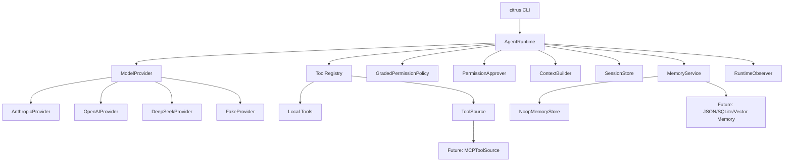

# CitrusButter V1 Architecture

CitrusButter is a Python SDK + CLI coding agent harness. It is inspired by
coding-agent systems such as Claude Code and `shareAI-lab/learn-claude-code`,
but it is designed as an original, modular, testable runtime kernel rather
than a fork or clone.

V1 focuses on a lightweight but extensible architecture: the agent can run
local coding tasks through a CLI, call multiple model providers, execute local
tools, enforce permissions, assemble context, record sessions, and reserve clear
extension points for future memory, MCP, hooks, sandboxing, and evaluation.

## Implementation Status

V1 is implemented in the current codebase. Verified capabilities:

- `AgentRuntime` executes a turn loop with model requests, tool calls,
  permission decisions, optional approval callbacks, and session events.
- CLI commands `run`, `providers`, and `config` are available.
- Project-local `.citrus/config.toml` is supported and ignored by git.
- Anthropic, OpenAI, DeepSeek, and Fake providers share the same
  `ModelProvider` interface.
- OpenAI-compatible providers, including DeepSeek, map internal messages,
  tool schemas, assistant tool calls, and tool-result messages with
  `tool_call_id` through adapter code.
- Local tools support workspace-scoped file read, file write, text search, and
  shell command execution, returning `ToolResult.tool_call_id` so provider
  adapters can correlate tool responses.
- `InMemorySessionStore` and `JsonlSessionStore` are implemented.
- CLI currently uses `InMemorySessionStore`; JSONL session persistence is an SDK
  capability but not yet the CLI default.
- DeepSeek was manually smoke-tested through the CLI with a real configured API
  key and returned `citrus-ok`.

Current verification:

```text
.venv/bin/pytest      55 passed
.venv/bin/ruff check  All checks passed
.venv/bin/mypy src    Success
```

## Goals

- Provide a reusable Python SDK for building coding-agent workflows.
- Provide a first-party CLI, `citrus`, as the main developer-facing interface.
- Support Anthropic, OpenAI, DeepSeek, and deterministic fake providers.
- Support local coding tools: read files, write files, search files, and run
  shell commands.
- Enforce a permission boundary before risky local actions.
- Keep the runtime kernel small and stable.
- Make future extensions mostly additive: new modules, new adapters, new tests,
  and minimal runtime changes.

## Non-Goals For V1

- Full MCP client implementation.
- Sophisticated long-term memory.
- Multi-agent orchestration.
- Git worktree sandboxing.
- Remote execution.
- Visual UI.
- Marketplace-style plugin system.

## Architecture Overview



The core rule is:

> `AgentRuntime` owns the loop. Everything else is a replaceable dependency.

Future features should attach through provider, tool, permission, context,
memory, session, or observer interfaces instead of modifying the runtime loop.

## Package Layout

```text
citrus/
  cli/
    app.py

  runtime/
    agent.py
    events.py
    messages.py

  providers/
    base.py
    anthropic.py
    openai.py
    deepseek.py
    fake.py

  tools/
    base.py
    registry.py
    sources.py
    local/
      read_file.py
      write_file.py
      search.py
      shell.py

  permissions/
    base.py
    policy.py

  context/
    builder.py

  memory/
    base.py
    noop.py
    service.py

  sessions/
    base.py
    jsonl.py
    memory.py

  config/
    __init__.py
    settings.py
```

## Core Runtime

`AgentRuntime` is the main SDK entry point. It coordinates model calls, tool
calls, permission checks, context assembly, session recording, memory hooks, and
observers.

```python
class AgentRuntime:
    def __init__(
        self,
        provider: ModelProvider,
        tools: ToolRegistry,
        permissions: GradedPermissionPolicy,
        context: ContextBuilder,
        session_store: SessionStore,
        permission_approver: PermissionApprover | None = None,
        memory: MemoryService | None = None,
        observers: list[RuntimeObserver] | None = None,
    ) -> None:
        ...

    def run(self, request: RunRequest) -> RunResult:
        ...
```

`AgentRuntime` should not know provider-specific APIs, concrete tool
implementations, memory storage details, or CLI behavior.

## Internal Message Model

CitrusButter uses its own internal message format. Provider adapters translate
between this internal format and external APIs.

```python
class Message(BaseModel):
    role: Literal["system", "user", "assistant", "tool"]
    content: list[ContentBlock]
    tool_call_id: str | None = None


class ToolCall(BaseModel):
    id: str
    name: str
    arguments: dict[str, Any]


class ToolResult(BaseModel):
    tool_call_id: str
    content: str
    is_error: bool = False
```

This prevents Anthropic, OpenAI, or DeepSeek formats from leaking into the
runtime. Provider adapters translate CitrusButter messages, tool schemas, and
tool-call responses at the adapter boundary.

## Provider Interface

```python
class ModelProvider(Protocol):
    name: str

    def complete(self, request: ModelRequest) -> ModelResponse:
        ...
```

V1 providers:

- `AnthropicProvider`
- `OpenAIProvider`
- `DeepSeekProvider`
- `FakeProvider`

`FakeProvider` is required for deterministic tests and offline demos.

Configuration can come from:

1. CLI flags.
2. Environment variables.
3. `CITRUS_CONFIG`.
4. Project-local `.citrus/config.toml`.
5. Global `~/.config/citrus/config.toml`.
6. Provider defaults.

Project-local `.citrus/config.toml` is preferred for development and is ignored
by git because it may contain API keys.

## Tool System

Tools expose local capabilities to the agent.

```python
class Tool(Protocol):
    name: str
    description: str
    input_schema: dict[str, Any]

    def run(self, input: dict[str, Any], context: ToolContext) -> ToolResult:
        ...
```

V1 local tools:

- `read_file`
- `write_file`
- `search_files`
- `run_shell`

Tools are registered through `ToolRegistry`.

```python
class ToolRegistry:
    def register(self, tool: Tool) -> None:
        ...

    def get(self, name: str) -> Tool:
        ...

    def list(self) -> list[Tool]:
        ...
```

Future MCP support should enter through `ToolSource`.

```python
class ToolSource(Protocol):
    def list_tools(self) -> list[Tool]:
        ...
```

V1 may define this interface without implementing a real MCP client.

## Permission System

Permissions are enforced before risky tool execution.

```python
class PermissionDecision(BaseModel):
    outcome: Literal["allow", "deny", "ask"]
    reason: str


class PermissionRequest(BaseModel):
    tool_name: str
    tool_call_id: str
    arguments: dict[str, object]
    reason: str
    command: str | None = None


PermissionApprover = Callable[[PermissionRequest], PermissionDecision]
```

Default V1 policy:

- File reads: allow by default.
- File writes: return `ask`.
- Shell commands: deny obviously dangerous commands and return `ask` for other
  shell execution.
- Unknown tools: return `ask`.

`AgentRuntime` resolves `ask` decisions in one place:

- `auto_approve=True` converts `ask` to `allow` for tests and scripted demos.
- If a `PermissionApprover` is configured, runtime calls it with the tool name,
  tool call id, arguments, reason, and optional shell command.
- If no approver is configured, runtime safely denies the tool.
- If an approver returns `ask` again, runtime treats the unresolved approval as
  denied instead of looping.

The CLI provides a Typer-based approver for `citrus run`, so write and shell
requests require explicit user confirmation. The permission system belongs to
runtime-level execution, not individual tools alone.

## Context System

`ContextBuilder` creates the model input for each turn.

```python
class ContextBuilder:
    def build(self, task: str) -> list[Message]:
        return [Message.user_text(task)]
```

V1 context currently includes only the user task. Current workspace summaries,
selected file snippets, tool result summaries, and memory context are future
`ContextSource` additions rather than V1 behavior.

Future retrieval can be added through a `ContextSource`-style interface. That
interface is not implemented in V1; the likely shape is a small protocol that
accepts the task and workspace metadata and returns additional `Message` or
context items for `ContextBuilder` to include.

## Memory System

V1 reserves memory boundaries but keeps the implementation lightweight.

Memory is not the same as session history:

- `SessionStore` records what happened.
- `ContextBuilder` decides what the model sees now.
- `MemoryService` manages facts that may be useful across future tasks.

```python
class MemoryStore(Protocol):
    def search(self, query: str) -> list[MemoryItem]:
        ...

    def put(self, item: MemoryItem) -> None:
        ...
```

```python
class MemoryService:
    def retrieve_for_task(self, task: str) -> list[MemoryItem]:
        ...

    def propose_updates(self, events: list[SessionEvent]) -> list[MemoryCandidate]:
        ...
```

V1 implementation:

- `NoopMemoryStore`

Future memory systems should attach as:

- `MemoryContextSource`: retrieves relevant memory before a task.
- `MemoryObserver`: observes runtime events and proposes memory updates.

## Session And Events

Sessions provide auditability, replay, debugging, and future eval support.

```python
class SessionStore(Protocol):
    def append(self, event: SessionEvent) -> None:
        ...

    def load(self, session_id: str) -> list[SessionEvent]:
        ...
```

V1 event types:

- `TaskStarted`
- `ContextBuilt`
- `ModelRequested`
- `ModelResponded`
- `ToolRequested`
- `PermissionRequested`
- `PermissionResolved`
- `ToolCompleted`
- `TaskCompleted`
- `TaskFailed`

Observers can subscribe to runtime events.

```python
class RuntimeObserver(Protocol):
    def on_event(self, event: SessionEvent) -> None:
        ...
```

Future hooks, tracing, eval, and memory extraction should use observers instead
of modifying `AgentRuntime`.

Current CLI note: the CLI constructs `InMemorySessionStore`, so events do not
persist after the command exits. `JsonlSessionStore` is available for SDK use and
should be wired into the CLI in the next session-persistence step.

## CLI

The CLI is a first-party client of the SDK.

```bash
citrus run "add tests for the parser"
citrus providers
citrus config
```

CLI commands should call SDK APIs instead of owning business logic.

V1 commands:

- `citrus run`: execute a coding task.
- `citrus providers`: show configured providers.
- `citrus config`: manage simple defaults.

Configuration should initially prefer environment variables and a small local
config file.

## Extension Rules

A future extension is healthy if it follows this pattern:

- New provider: add a `ModelProvider` implementation.
- New tool: add a `Tool` implementation and register it.
- MCP support: add `MCPToolSource`.
- Memory backend: add a `MemoryStore`.
- Hooks or eval: add a `RuntimeObserver`.
- New context behavior: add a `ContextSource`.
- New approval behavior: provide a `PermissionApprover` or replace
  `GradedPermissionPolicy`.

The preferred change shape is:

```text
new implementation + registration + contract tests
```

The discouraged change shape is:

```text
modify AgentRuntime for every new feature
```

## Testing Strategy

V1 must prove the architecture works through tests.

Required test groups:

- Provider contract tests with `FakeProvider`.
- Tool contract tests for local tools.
- Permission tests for read, write, shell, denied actions, CLI prompts,
  approver allow/deny decisions, missing approvers, and unresolved approvals.
- Context builder tests for deterministic context assembly.
- Runtime integration tests using fake model responses and fake tool calls.
- CLI smoke tests for `run`, `providers`, and `config`.
- Extension contract tests proving new providers, tools, memory stores, and
  observers can attach without runtime changes.

## V1 Success Criteria

V1 is complete when:

- `citrus run` can complete a small local coding task.
- Anthropic, OpenAI, DeepSeek, and Fake providers share one internal provider
  interface.
- File and shell tools run through permission checks and approval callbacks
  for `ask` decisions.
- Sessions record structured runtime events.
- Memory has stable interfaces and a no-op implementation.
- MCP has a documented `ToolSource` extension path.
- Tests verify the runtime and extension contracts.
- README explains the architecture, quickstart, examples, and roadmap.
